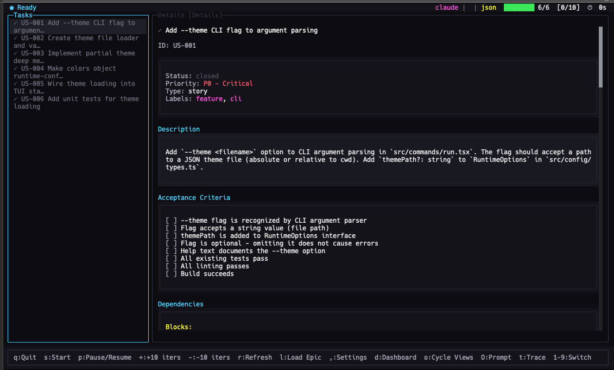

# Orbit

[](https://www.npmjs.com/package/orbit)
[](https://github.com/subsy/orbit/actions/workflows/ci.yml)
[](https://codecov.io/gh/subsy/orbit)
[](https://opensource.org/licenses/MIT)
[](https://bun.sh)

**AI Agent Loop Orchestrator** - A terminal UI for orchestrating AI coding agents to work through task lists autonomously.

Orbit connects your AI coding assistant (Claude Code, OpenCode, Factory Droid, Gemini CLI, Codex, Kiro CLI) to your task tracker and runs them in an autonomous loop, completing tasks one-by-one with intelligent selection, error handling, and full visibility.


## Quick Start

```bash
# Install
bun install -g orbit

# Setup your project
cd your-project
orbit setup

# Create a PRD with AI assistance
orbit create-prd --chat

# Run Orbit!
orbit run --prd ./prd.json
```

That's it! Orbit will work through your tasks autonomously.

## Documentation

**[orbit.com](https://orbit.com)** - Full documentation, guides, and examples.

### Quick Links

- **[Quick Start Guide](https://orbit.com/docs/getting-started/quick-start)** - Get running in 2 minutes
- **[Installation](https://orbit.com/docs/getting-started/installation)** - All installation options
- **[CLI Reference](https://orbit.com/docs/cli/overview)** - Complete command reference
- **[Configuration](https://orbit.com/docs/configuration/overview)** - Customize Orbit for your workflow
- **[Troubleshooting](https://orbit.com/docs/troubleshooting/common-issues)** - Common issues and solutions

## How It Works

```
┌─────────────────────────────────────────────────────────────────┐
│                                                                 │
│   ┌──────────────┐     ┌──────────────┐     ┌──────────────┐   │
│   │  1. SELECT   │────▶│  2. BUILD    │────▶│  3. EXECUTE  │   │
│   │    TASK      │     │    PROMPT    │     │    AGENT     │   │
│   └──────────────┘     └──────────────┘     └──────────────┘   │
│          ▲                                         │            │
│          │                                         ▼            │
│   ┌──────────────┐                         ┌──────────────┐    │
│   │  5. NEXT     │◀────────────────────────│  4. DETECT   │    │
│   │    TASK      │                         │  COMPLETION  │    │
│   └──────────────┘                         └──────────────┘    │
│                                                                 │
└─────────────────────────────────────────────────────────────────┘
```

Orbit selects the highest-priority task, builds a prompt, executes your AI agent, detects completion, and repeats until all tasks are done.

## Features

- **Task Trackers**: prd.json (simple), Beads (git-backed with dependencies)
- **AI Agents**: Claude Code, OpenCode, Factory Droid, Gemini CLI, Codex, Kiro CLI
- **Session Persistence**: Pause anytime, resume later, survive crashes
- **Real-time TUI**: Watch agent output, control execution with keyboard shortcuts
- **Subagent Tracing**: See nested agent calls in real-time
- **Cross-iteration Context**: Automatic progress tracking between tasks
- **Flexible Skills**: Use PRD/task skills directly in your agent or via the TUI
- **Remote Instances**: Monitor and control orbit running on multiple machines from a single TUI

## CLI Commands

| Command | Description |
|---------|-------------|
| `orbit` | Launch the interactive TUI |
| `orbit run [options]` | Start Orbit execution |
| `orbit resume` | Resume an interrupted session |
| `orbit status` | Check session status |
| `orbit logs` | View iteration output logs |
| `orbit setup` | Run interactive project setup |
| `orbit create-prd` | Create a new PRD interactively |
| `orbit convert` | Convert PRD to tracker format |
| `orbit config show` | Display merged configuration |
| `orbit template show` | Display current prompt template |
| `orbit plugins agents` | List available agent plugins |
| `orbit plugins trackers` | List available tracker plugins |
| `orbit run --listen` | Run with remote listener enabled |
| `orbit remote <cmd>` | Manage remote server connections |

### Common Options

```bash
# Run with a PRD file
orbit run --prd ./prd.json

# Run with a Beads epic
orbit run --epic my-epic-id

# Override agent or model
orbit run --agent claude --model sonnet
orbit run --agent opencode --model anthropic/claude-3-5-sonnet

# Limit iterations
orbit run --iterations 5

# Run headless (no TUI)
orbit run --headless

# Run agent in isolated sandbox (bwrap on Linux, sandbox-exec on macOS)
# Requires bwrap to be installed and on PATH (Linux) or uses built-in sandbox-exec (macOS)
orbit run --sandbox

# Use a bundled color theme by name
orbit run --theme dracula
```

### Create PRD Options

```bash
# Create a PRD with AI assistance (default chat mode)
orbit create-prd
orbit prime  # Alias

# Use a custom PRD skill from skills_dir
orbit create-prd --prd-skill my-custom-skill

# Override agent
orbit create-prd --agent claude

# Output to custom directory
orbit create-prd --output ./docs
```

### TUI Keyboard Shortcuts

| Key | Action |
|-----|--------|
| `s` | Start execution |
| `p` | Pause/Resume |
| `d` | Toggle dashboard |
| `T` | Toggle subagent tree panel (Shift+T) |
| `t` | Cycle subagent detail level |
| `o` | Cycle right panel views |
| `,` | Open settings (local tab only) |
| `C` | Open read-only config viewer (Shift+C, works on local and remote tabs) |
| `q` | Quit |
| `?` | Show help |
| `1-9` | Switch to tab 1-9 (remote instances) |
| `[` / `]` | Previous/Next tab |
| `a` | Add new remote instance |
| `e` | Edit current remote (when viewing remote tab) |
| `x` | Delete current remote (when viewing remote tab) |

**Dashboard (`d` key):** Toggle a status panel showing:
- Current execution status and active task
- Agent name and model (e.g., `claude-code`, `anthropic/claude-sonnet`)
- Tracker source (e.g., `prd`, `beads`)
- Git branch with dirty indicator (repo:branch*)
- Sandbox status (🔒 enabled, 🔓 disabled) with mode
- Auto-commit setting (✓ auto, ✗ manual)
- Remote connection info (when viewing remote tabs)

See the [full CLI reference](https://orbit.com/docs/cli/overview) for all options.

### Custom Themes

Orbit supports custom color themes via the `--theme` option:

```bash
# Use a bundled theme by name
orbit run --theme dracula

# Or use a custom theme file
orbit run --theme ./my-custom-theme.json
```



Bundled themes: `bright`, `catppuccin`, `dracula`, `high-contrast`, `solarized-light`

See the [Themes documentation](https://orbit.com/docs/configuration/themes) for the full theme schema and creating custom themes.

### Using Skills Directly in Your Agent

Install orbit skills to your agent using [add-skill](https://github.com/vercel-labs/add-skill):

```bash
# Install all skills to all detected agents globally
bunx add-skill subsy/orbit --all

# Install to a specific agent
bunx add-skill subsy/orbit -a claude-code -g -y

# Or use the orbit wrapper (maps agent IDs automatically)
orbit skills install
orbit skills install --agent claude
```

Use these slash commands in your agent:

```bash
/orbit-prd           # Create a PRD interactively
/orbit-create-json   # Convert PRD to prd.json
/orbit-create-beads  # Convert PRD to Beads issues
```

This lets you create PRDs while referencing source files (`@filename`) and using your full conversation context—then use `orbit run` for autonomous execution.

### Custom Skills Directory

You can configure a custom `skills_dir` in your config file to use custom PRD skills:

```bash
# In .orbit/config.toml or ~/.config/orbit/config.toml
skills_dir = "/path/to/my-skills"

# Then use custom skills
orbit create-prd --prd-skill my-custom-skill
```

Skills must be folders inside `skills_dir` containing a `SKILL.md` file.

## Remote Instance Management

Control multiple orbit instances running on different machines (VPS servers, CI/CD environments, development boxes) from a single TUI.

```
┌─────────────────────────────────────────────────────────────────┐
│  LOCAL [1]│ ● prod [2]│ ◐ staging [3]│ ○ dev [4]│      +       │
├─────────────────────────────────────────────────────────────────┤
│                                                                 │
│   Your local TUI can connect to and control remote instances    │
│                                                                 │
└─────────────────────────────────────────────────────────────────┘
```

### Quick Start: Remote Control

**On the remote machine (server):**
```bash
# Start ralph with remote listener enabled
orbit run --listen --prd ./prd.json

# First run generates a secure token - save it!
# ═══════════════════════════════════════════════════════════════
#                    Remote Listener Enabled
# ═══════════════════════════════════════════════════════════════
#   Port: 7890
#   New server token generated:
#   OGQwNTcxMjM0NTY3ODkwYWJjZGVmMDEyMzQ1Njc4OQ
#   ⚠️  Save this token securely - it won't be shown again!
# ═══════════════════════════════════════════════════════════════
```

**On your local machine (client):**
```bash
# Add the remote server
orbit remote add prod server.example.com:7890 --token OGQwNTcxMjM0NTY3...

# Test the connection
orbit remote test prod

# Launch TUI - you'll see tabs for local + remote instances
orbit
```

### Remote Listener Commands

**Recommended: Use `run --listen`** (runs engine with remote access):
```bash
# Start with remote listener on default port (7890)
orbit run --listen --prd ./prd.json

# Start with custom port
orbit run --listen --listen-port 8080 --epic my-epic
```

**Token management:**
```bash
# Rotate authentication token (invalidates old token immediately)
orbit run --listen --rotate-token --prd ./prd.json

# View remote listener options
orbit run --help
```

### Remote Configuration Commands

```bash
# Add a remote server
orbit remote add <alias> <host:port> --token <token>

# List all remotes with connection status
orbit remote list

# Test connectivity to a specific remote
orbit remote test <alias>

# Remove a remote
orbit remote remove <alias>

# Push config to a remote (propagate your local settings)
orbit remote push-config <alias>
orbit remote push-config --all  # Push to all remotes
```

### Push Configuration to Remotes

When managing multiple orbit instances, you typically want them all to use the same configuration. The `push-config` command lets you propagate your local config to remote instances:

```bash
# Push config to a specific remote
orbit remote push-config prod

# Preview what would be pushed (without applying)
orbit remote push-config prod --preview

# Push to all configured remotes
orbit remote push-config --all

# Force overwrite existing config without confirmation
orbit remote push-config prod --force

# Push specific scope (global or project config)
orbit remote push-config prod --scope global
orbit remote push-config prod --scope project
```

**How it works:**
1. Reads your local config (`~/.config/orbit/config.toml` or `.orbit/config.toml`)
2. Connects to the remote instance
3. Checks what config exists on the remote
4. Creates a backup if overwriting (e.g., `config.toml.backup.2026-01-19T12-30-00-000Z`)
5. Writes the new config
6. Triggers auto-migration to install skills/templates

**Scope selection:**
- `--scope global`: Push to `~/.config/orbit/config.toml` on remote
- `--scope project`: Push to `.orbit/config.toml` in remote's working directory
- Without `--scope`: Auto-detects based on what exists locally and remotely

### Security Model

Orbit uses a two-tier token system for secure remote access:

| Token Type | Lifetime | Purpose |
|------------|----------|---------|
| Server Token | 90 days | Initial authentication, stored on disk |
| Connection Token | 24 hours | Session authentication, auto-refreshed |

**Security features:**
- Without a token configured, the listener binds only to localhost (127.0.0.1)
- With a token configured, the listener binds to all interfaces (0.0.0.0)
- All connections require authentication
- All remote actions are logged to `~/.config/orbit/audit.log`
- Tokens are shown only once at generation time

### Connection Resilience

Remote connections automatically handle network interruptions:

- **Auto-reconnect**: Exponential backoff from 1s to 30s (max 10 retries)
- **Silent retries**: First 3 retries are silent, then toast notifications appear
- **Status indicators**: `●` connected, `◐` connecting, `⟳` reconnecting, `○` disconnected
- **Metrics display**: Latency (ms) and connection duration shown in tab bar

### Tab Navigation

When connected to remote instances, a tab bar appears at the top of the TUI:

| Key | Action |
|-----|--------|
| `1-9` | Jump directly to tab 1-9 |
| `[` | Previous tab |
| `]` | Next tab |
| `Ctrl+Tab` | Next tab |
| `Ctrl+Shift+Tab` | Previous tab |

The first tab is always "Local" (your current machine). Remote tabs show the alias you configured with connection status.

### Managing Remotes from the TUI

You can add, edit, and delete remote servers directly from the TUI without leaving the interface:

**Add Remote (`a` key):**
Opens a form dialog to configure a new remote:
- **Alias**: A short name for the remote (e.g., "prod", "dev-server")
- **Host**: The server address (e.g., "192.168.1.100", "server.example.com")
- **Port**: The listener port (default: 7890)
- **Token**: The server token (displayed on the remote when you start with `--listen`)

Use `Tab`/`Shift+Tab` to move between fields, `Enter` to save, `Esc` to cancel.

**Edit Remote (`e` key):**
When viewing a remote tab, press `e` to edit its configuration. The form pre-fills with current values. You can change any field, including the alias.

**Delete Remote (`x` key):**
When viewing a remote tab, press `x` to delete it. A confirmation dialog shows the remote details before deletion.

### Full Remote Control

When connected to a remote instance, you have full control:

- **View**: Agent output, logs, progress, task list
- **Control**: Pause, resume, cancel execution
- **Modify**: Add/remove iterations, refresh tasks
- **Start**: Begin new task execution

All operations work identically to local control with <100ms perceived latency.

### Configuration Files

| File | Purpose |
|------|---------|
| `~/.config/orbit/remote.json` | Server token storage |
| `~/.config/orbit/remotes.toml` | Remote server configurations |
| `~/.config/orbit/audit.log` | Audit log of all remote actions |
| `~/.config/orbit/listen.pid` | Daemon PID file |

## Contributing

### Development Setup

```bash
git clone https://github.com/subsy/orbit.git
cd orbit
bun install
bun run dev
```

### Build & Test

```bash
bun run build       # Build the project
bun run typecheck   # Type check (no emit)
bun run lint        # Run linter
bun run lint:fix    # Auto-fix lint issues
```

### Testing

```bash
bun test            # Run all tests
bun test --watch    # Run tests in watch mode
bun test --coverage # Run tests with coverage
```

See [CONTRIBUTING.md](CONTRIBUTING.md#testing) for detailed testing documentation including:
- Test file naming conventions
- Using factories and mocks
- Writing new tests
- Coverage requirements

### Pull Request Requirements

PRs must meet these requirements before being merged:
- **>50% test coverage** on new/changed lines (enforced by Codecov)
- **Documentation updates** for any new or changed features
- All CI checks passing (typecheck, lint, tests)

See [CONTRIBUTING.md](CONTRIBUTING.md#pull-request-guidelines) for full PR guidelines.

### Project Structure

```
orbit/
├── src/
│   ├── cli.tsx           # CLI entry point
│   ├── commands/         # CLI commands (run, resume, status, logs, listen, remote, etc.)
│   ├── config/           # Configuration loading and validation (Zod schemas)
│   ├── engine/           # Execution engine (iteration loop, events)
│   ├── interruption/     # Signal handling and graceful shutdown
│   ├── logs/             # Iteration log persistence
│   ├── plugins/
│   │   ├── agents/       # Agent plugins (claude, opencode)
│   │   │   └── tracing/  # Subagent tracing parser
│   │   └── trackers/     # Tracker plugins (beads, beads-bv, json)
│   ├── remote/           # Remote instance management
│   │   ├── server.ts     # WebSocket server for remote control
│   │   ├── client.ts     # WebSocket client with auto-reconnect
│   │   ├── token.ts      # Two-tier token management
│   │   ├── config.ts     # Remote server configuration (TOML)
│   │   ├── audit.ts      # JSONL audit logging
│   │   └── types.ts      # Type definitions
│   ├── session/          # Session persistence and lock management
│   ├── setup/            # Interactive setup wizard
│   ├── templates/        # Handlebars prompt templates
│   ├── chat/             # AI chat mode for PRD creation
│   ├── prd/              # PRD generation and parsing
│   └── tui/              # Terminal UI components (OpenTUI/React)
│       └── components/   # React components (TabBar, Toast, etc.)
├── skills/               # Bundled skills for PRD/task creation
│   ├── orbit-prd/
│   ├── orbit-create-json/
│   └── orbit-create-beads/
├── website/              # Documentation website (Next.js)
└── docs/                 # Images and static assets
```

### Key Technologies

- [Bun](https://bun.sh) - JavaScript runtime
- [OpenTUI](https://github.com/sst/opentui) - Terminal UI framework
- [Handlebars](https://handlebarsjs.com) - Prompt templating

See [CLAUDE.md](CLAUDE.md) for detailed development guidelines.

## Credits

Thanks to Geoffrey Huntley for the [original Orbit Wiggum loop concept](https://ghuntley.com/ralph/).

## License

MIT License - see [LICENSE](LICENSE) for details.
